# Laboratorio — Simulación de recuperación en entorno controlado (Kali Linux + Docker)

## Objetivo

Implementar un laboratorio educativo utilizando Kali Linux dentro de Docker para representar un escenario controlado de impacto y recuperación.

El laboratorio busca comprender el flujo básico de funcionamiento de un ransomware utilizando:

* Python
* Fernet
* sockets TCP
* arquitectura cliente-servidor
* automatización de archivos
* Linux + Docker

---

# Aviso Legal

Este laboratorio fue desarrollado únicamente con fines educativos y de aprendizaje en entornos controlados.

NO utilizar este código contra sistemas que no sean propios o autorizados.

---

# Arquitectura del laboratorio

## Arquitectura general

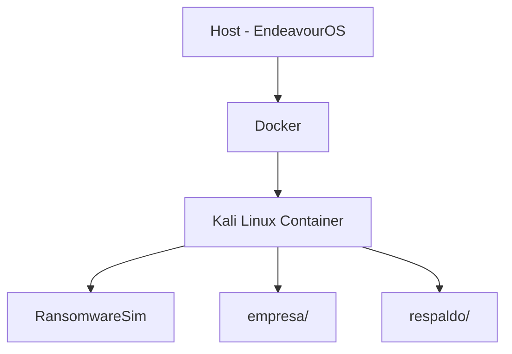

---

## Flujo general del laboratorio

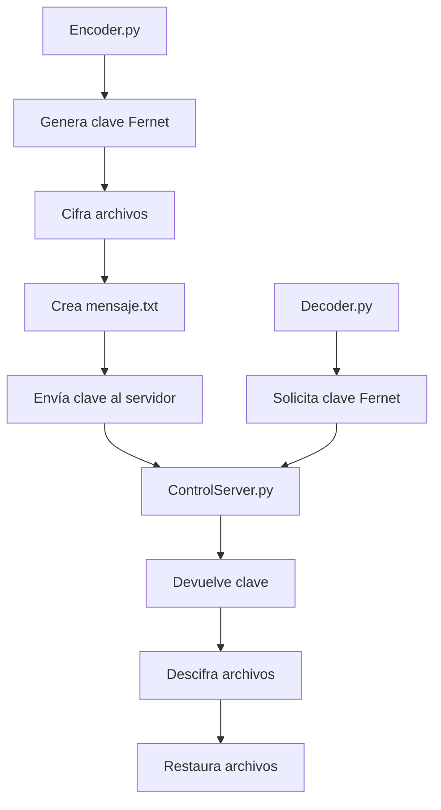

---

## Flujo de cifrado

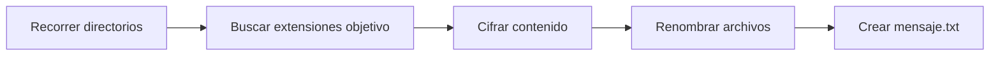

---

## Flujo de recuperación

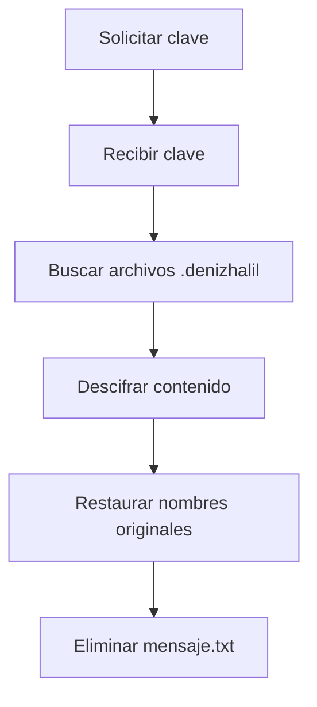

---

# Arquitectura del proyecto

```text id="wk9j2e"
EndeavourOS (Host)

└── Docker

    └── Kali Linux

        └── lab_ransom/

            ├── RansomwareSim/
            │   ├── Encoder.py
            │   ├── Decoder.py
            │   ├── ControlServer.py
            │   ├── requirements.txt
            │   └── ...
            │
            ├── empresa/
            │   ├── finanzas/
            │   ├── rrhh/
            │   └── gerencia/
            │
            └── respaldo/
```

---

# Paso 1 — Verificar contenedor Docker

Verificar contenedores:

```bash id="mjjlwm"
docker ps -a
```

Iniciar Kali:

```bash id="jlwm44"
docker start -ai kali
```

---

# Paso 2 — Preparar entorno

Actualizar repositorios:

```bash id="jlwm45"
apt update
```

Instalar herramientas necesarias:

```bash id="jlwm46"
apt install -y git python3 python3-pip python3-venv tree neovim
```

---

# Paso 3 — Crear laboratorio

Crear directorio:

```bash id="jlwm47"
mkdir /lab_ransom
```

Entrar:

```bash id="jlwm48"
cd /lab_ransom
```

---

# Paso 4 — Clonar repositorio

Clonar:

```bash id="jlwm49"
git clone https://github.com/HalilDeniz/RansomwareSim.git
```

Entrar:

```bash id="jlwm50"
cd RansomwareSim
```

Verificar contenido:

```bash id="jlwm51"
tree -L 1
```

Resultado esperado:

```text id="jlwm52"
.
├── ControlServer.py
├── Decoder.py
├── Encoder.py
├── LICENSE
├── Readme.md
├── SECURITY.md
├── img
└── requirements.txt
```

---

# Paso 5 — Crear entorno virtual

Crear entorno virtual:

```bash id="jlwm53"
python3 -m venv lab_ransom
```

Activar:

```bash id="jlwm54"
source lab_ransom/bin/activate
```

Verificar:

```bash id="jlwm55"
which python
```

Instalar dependencias:

```bash id="jlwm56"
pip install -r requirements.txt
```

Instalar colorama:

```bash id="jlwm57"
pip install colorama
```

Verificar librerías:

```bash id="jlwm58"
pip list
```

---

# Paso 6 — Crear estructura de empresa

Volver al directorio principal:

```bash id="jlwm59"
cd ..
```

Crear directorios:

```bash id="jlwm60"
mkdir -p empresa/{finanzas,rrhh,gerencia}
```

Crear archivos simulados:

```bash id="jlwm61"
touch empresa/finanzas/{clientes.xlsx,pagos.pdf,facturas.docx}
```

```bash id="jlwm62"
touch empresa/rrhh/{empleados.docx,contratos.pdf,nomina.xlsx}
```

```bash id="jlwm63"
touch empresa/gerencia/{reportes.docx,estrategia.txt,proyectos.pdf}
```

---

# Paso 7 — Crear respaldo

Crear backup:

```bash id="jlwm64"
cp -r empresa respaldo
```

---

# Verificación final

```bash id="jlwm65"
tree -L 3
```

Resultado esperado:

```text id="jlwm66"
.
├── RansomwareSim
│   ├── ControlServer.py
│   ├── Decoder.py
│   ├── Encoder.py
│   ├── requirements.txt
│   └── ...
│
├── empresa
│   ├── finanzas
│   ├── gerencia
│   └── rrhh
│
└── respaldo
```

---

# Screenshots

## Estructura inicial

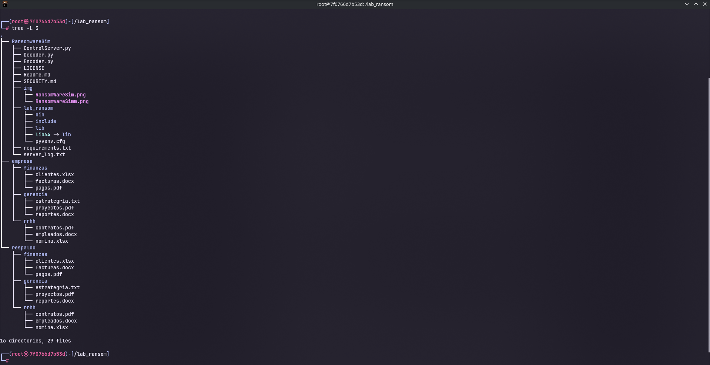

---

## Servidor escuchando

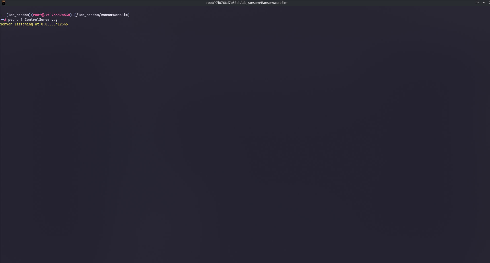

---

## Empresa antes del cifrado


---

## Ejecución de Encoder.py

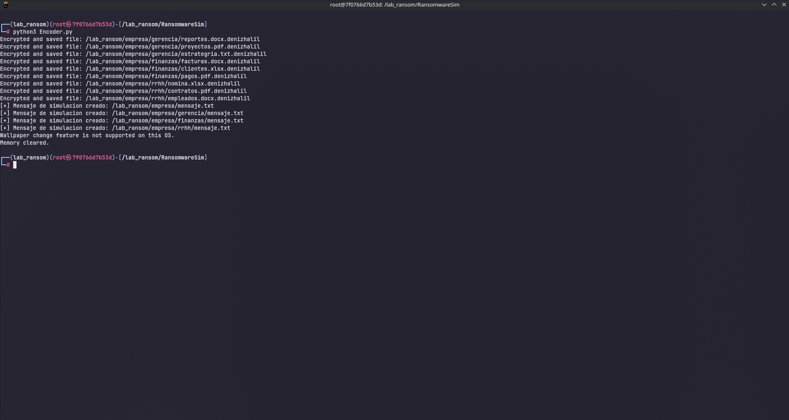

---

## Archivos cifrados

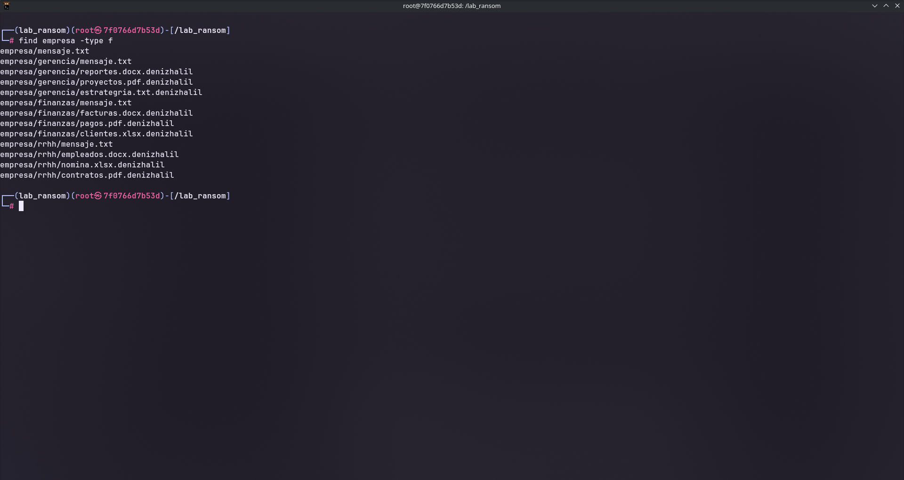

---

## Mensaje generado


---

## Clave resivida por el servidor

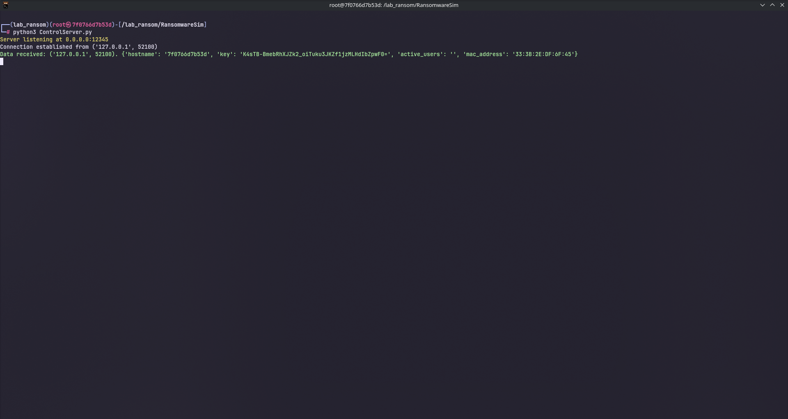

---

## Recuperación con Decoder.py

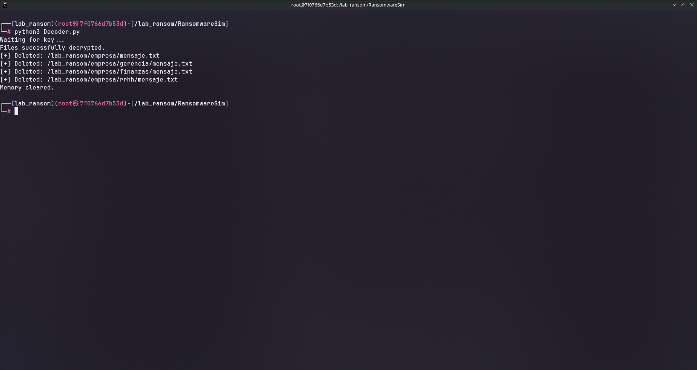

---

## Recuperación exitosa

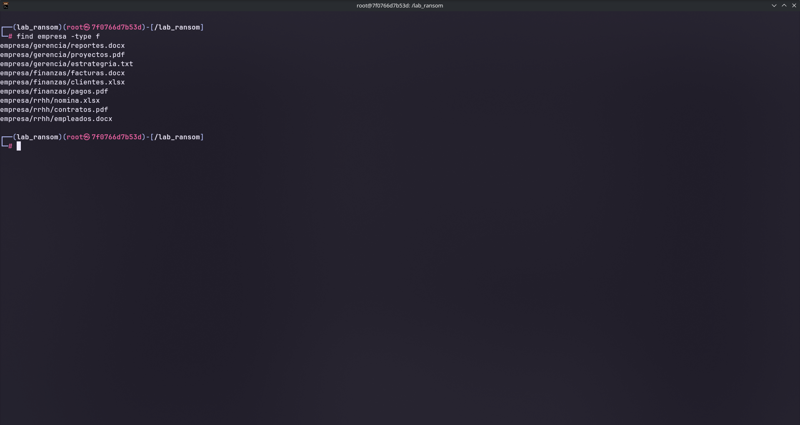

# Ejecución del cifrado

El proyecto original fue diseñado para Windows.

Durante el laboratorio se realizaron múltiples modificaciones para adaptarlo correctamente a Docker + Kali Linux.

---

# ControlServer.py

## Iniciar servidor

Primera terminal:

```bash id="jlwm67"
python3 ControlServer.py
```

---

# Encoder.py

## Abrir segunda terminal

Ejecutar:

```bash id="jlwm68"
docker exec -it kali bash
```

Entrar:

```bash id="jlwm69"
cd /lab_ransom/RansomwareSim
```

Activar entorno virtual:

```bash id="jlwm70"
source lab_ransom/bin/activate
```

---

## Cambio de directorio objetivo

Implementación original:

```python id="jlwm71"
directory = 'dosyalar/'
```

Nueva implementación:

```python id="jlwm72"
directory = '/lab_ransom/empresa/'
```

---

## Cambio de host TCP

Implementación original:

```python id="jlwm73"
server_host = '10.0.2.37'
```

Nueva implementación:

```python id="jlwm74"
server_host = '127.0.0.1'
```

Motivo:

```text id="jlwm75"
Todos los componentes se ejecutan dentro del mismo contenedor Kali Linux.
```

---

## Agregado de extensiones objetivo

Implementación utilizada:

```python id="jlwm76"
file_extensions = ['.txt', '.docx', '.jpg', '.xlsx', '.pdf']
```

Objetivo:

```text id="jlwm77"
Representar múltiples tipos de información corporativa dentro del laboratorio.
```

---

## Adaptación de create_readme()

La implementación original estaba diseñada para Windows Desktop.

### Implementación original

```python id="jlwm78"
def create_readme(self):

    desktop_path = os.path.join(
        os.path.join(os.environ['USERPROFILE']),
        'Desktop'
    )

    readme_path = os.path.join(desktop_path, 'Readme.txt')
```

### Problemas detectados

```text id="jlwm79"
- USERPROFILE es exclusivo de Windows
- Docker/Kali no utiliza Desktop
- El laboratorio no posee entorno gráfico
```

### Nueva implementación

```python id="jlwm80"
def create_readme(self):

    for root, dirs, files in os.walk(self.directory):

        readme_path = os.path.join(root, "mensaje.txt")

        with open(readme_path, "w") as file:

            file.write(
                "=== SIMULACIÓN DE RANSOMWARE ===\n\n"
                "Sus archivos han sido cifrados como parte "
                "de una práctica educativa.\n"
                "No se preocupe, esto es solo una simulación.\n\n"
                f"Directorio afectado:\n{root}\n"
            )
```

Resultado:

```text id="jlwm81"
empresa/
├── mensaje.txt
├── finanzas/
│   └── mensaje.txt
├── rrhh/
│   └── mensaje.txt
└── gerencia/
    └── mensaje.txt
```

---

## Cambio de orden de ejecución

Implementación original:

```python id="jlwm82"
simulator.find_and_encrypt_files()
simulator.send_data_to_server()
simulator.create_readme()
```

Nueva implementación:

```python id="jlwm83"
simulator.find_and_encrypt_files()
simulator.create_readme()
simulator.send_data_to_server()
```

Motivo:

```text id="jlwm84"
Si la conexión TCP fallaba, el programa terminaba antes
de crear las notas mensaje.txt.
```

---

## Ejecutar cifrado

Segunda terminal:

```bash id="jlwm85"
python3 Encoder.py
```

Funcionamiento:

```text id="jlwm86"
- Genera clave Fernet
- Recorre directorios
- Cifra archivos
- Crea mensaje.txt
- Envía información al servidor
```

---

# Resultado esperado

```text id="jlwm87"
empresa/
├── finanzas/
│   ├── clientes.xlsx.denizhalil
│   ├── pagos.pdf.denizhalil
│   └── mensaje.txt
```

Verificar archivos cifrados:

```bash id="jlwm88"
find /lab_ransom/empresa -type f
```

---

# Escenarios de recuperación

## Caso 1 — Existe respaldo

Recuperación mediante backup:

```bash id="jlwm89"
rm -rf empresa
cp -r respaldo empresa
```

Funcionamiento:

```text id="jlwm90"
- Se elimina el directorio afectado
- Se restaura la información desde respaldo
- No es necesario utilizar Decoder.py
```

---

## Caso 2 — No existe respaldo

Recuperación simulada utilizando Decoder.py y ControlServer.py.

---

# Decoder.py

## Cambio de directorio objetivo

Implementación original:

```python id="jlwm91"
directory = 'dosyalar/'
```

Nueva implementación:

```python id="jlwm92"
directory = '/lab_ransom/empresa/'
```

---

## Cambio de host TCP

Implementación original:

```python id="jlwm93"
server_host = '10.0.2.37'
```

Nueva implementación:

```python id="jlwm94"
server_host = '127.0.0.1'
```

---

## Conversión de clave Fernet

Problema detectado:

```python id="jlwm95"
fernet = Fernet(key)
```

La clave recibida desde JSON llegaba como string.

### Solución implementada

```python id="jlwm96"
fernet = Fernet(key.encode())
```

Motivo:

```text id="jlwm97"
Fernet requiere la clave en formato bytes.
```

---

## Adaptación de delete_readme()

La implementación original dependía de Windows Desktop.

### Implementación original

```python id="jlwm98"
def delete_readme(self):

    desktop_path = os.path.join(
        os.path.join(os.environ['USERPROFILE']),
        'Desktop'
    )
```

### Nueva implementación

```python id="jlwm99"
def delete_readme(self):

    for root, dirs, files in os.walk(self.directory):

        for file in files:

            if file == "mensaje.txt":

                readme_path = os.path.join(root, file)

                os.remove(readme_path)
```

---

## Ejecutar descifrado

Ejecutar en la segunda terminal:

```bash id="jlwm100"
python3 Decoder.py
```

Funcionamiento:

```text id="jlwm101"
- Solicita la clave al servidor
- Descifra archivos .denizhalil
- Restaura archivos originales
- Elimina mensaje.txt
```

---

# Flujo de recuperación

```text id="jlwm102"
1. Ejecutar ControlServer.py
2. Ejecutar Encoder.py
3. El servidor recibe la clave Fernet
4. Ejecutar Decoder.py
5. Decoder solicita la clave
6. ControlServer muestra la clave
7. Ingresar la clave Fernet recibida
8. Los archivos son restaurados
```

---

# Análisis técnico

## ¿Por qué Fernet?

Fernet fue utilizado porque proporciona:

* cifrado simétrico
* autenticación integrada
* implementación sencilla en Python

Esto facilita comprender el flujo encrypt/decrypt sin implementar algoritmos manualmente.

Además:

* Fernet genera tokens seguros
* evita errores criptográficos comunes
* simplifica laboratorios educativos

---

## ¿Qué es el cifrado simétrico?

El cifrado simétrico utiliza la misma clave para:

* cifrar
* descifrar

En este laboratorio:

```text id="jlwm103"
Encoder.py  -> cifra archivos
Decoder.py  -> utiliza la misma clave para restaurarlos
```

Esto permite comprender cómo funciona un flujo básico de ransomware.

---

## ¿Por qué Docker?

Docker permite:

* aislamiento
* repetibilidad
* pruebas más seguras

Ventajas observadas:

* entorno controlado
* fácil restauración
* separación entre host y laboratorio
* pruebas reproducibles

---

## ¿Por qué localhost?

Todos los componentes se ejecutan dentro del mismo contenedor Kali Linux.

Por eso:

```python id="jlwm104"
server_host = '127.0.0.1'
```

funciona correctamente.

---

## ¿Por qué falló USERPROFILE?

El proyecto original fue desarrollado para Windows.

Windows utiliza:

```text id="jlwm105"
Desktop/
```

como estructura común del escritorio.

Sin embargo:

* Linux no utiliza USERPROFILE
* Docker no posee entorno gráfico
* Kali dentro del contenedor no tiene Desktop

Por eso:

```python id="jlwm106"
os.environ['USERPROFILE']
```

no funcionaba correctamente.

---

## ¿Por qué fue necesario .encode()?

La clave Fernet llegaba desde JSON como string.

Sin embargo:

```python id="jlwm107"
Fernet()
```

requiere bytes.

La solución implementada fue:

```python id="jlwm108"
fernet = Fernet(key.encode())
```

---

## ¿Por qué os.walk() fue importante?

```python id="jlwm109"
os.walk()
```

permitió:

* recorrer directorios recursivamente
* automatizar búsqueda de archivos
* aplicar cifrado masivo

Esto fue fundamental para:

* localizar archivos objetivo
* crear mensaje.txt automáticamente
* eliminar mensajes durante recuperación

---

## ¿Por qué el orden de ejecución era importante?

Implementación original:

```python id="jlwm110"
simulator.find_and_encrypt_files()
simulator.send_data_to_server()
simulator.create_readme()
```

Problema:

Si la conexión TCP fallaba:

* el programa terminaba
* mensaje.txt nunca era creado

Nueva implementación:

```python id="jlwm111"
simulator.find_and_encrypt_files()
simulator.create_readme()
simulator.send_data_to_server()
```

Esto mejoró la estabilidad del laboratorio.

---

# Lo aprendido

## Docker

* los contenedores facilitan pruebas aisladas
* Docker simplifica laboratorios reproducibles
* localhost funciona distinto dentro de Docker
* los contenedores poseen su propio entorno
* Docker ayuda a practicar sin afectar el host

---

## Python

* os.walk() facilita recorrer directorios
* los sockets requieren orden de ejecución
* el filtrado de extensiones es importante
* automatizar archivos requiere cuidado
* los errores de rutas son comunes

---

## Linux

* las rutas Linux son distintas a Windows
* Desktop no existe por defecto
* los permisos afectan automatización
* Docker modifica el comportamiento del entorno

---

## Redes y sockets TCP

* cliente y servidor deben ejecutarse en orden
* localhost puede utilizarse dentro del mismo contenedor
* TCP requiere manejo correcto de conexión

---

## Criptografía

* Fernet utiliza cifrado simétrico
* encrypt/decrypt utilizan la misma clave
* el manejo de claves debe ser preciso
* bytes y strings no son equivalentes

---

# Lecciones aprendidas

* los backups son más efectivos que descifrar
* el código Windows suele fallar en Linux
* Docker simplifica laboratorios de malware
* documentar ayuda a entender mejor
* los errores enseñan más que copiar código
* pequeños errores pueden romper automatizaciones completas

---

# Objetivo educativo

Este laboratorio fue desarrollado únicamente con fines educativos
y de aprendizaje en entornos controlados.

El objetivo es comprender:

* cifrado simétrico
* flujo encrypt/decrypt
* sockets TCP
* arquitectura cliente-servidor
* automatización de archivos
* adaptación Windows → Linux
* recuperación de información
* manejo de claves Fernet
